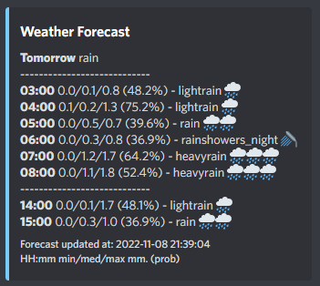

# weather-bot
[](https://github.com/roedebaron/weather-bot/actions/workflows/deploy.yaml)

Discord bot that keeps you updated when it is going to rain 🌧



Weather forecasts are fetched from the [YR API](https://developer.yr.no/).

Features:

- Get notified about the weather forecast for today or tomorrow at a custom time every day
- Ask for the current weather

## Local setup

Set up environment config

- Insert Discord bot token and a default lat/lon into `example.env` (see [Using a database](using-a-database-not-implemented) for using a database to store a default coordinate for each guild)
- Rename the file to `.env`
  - Or a use a custom name (e.g. `dev.env` or `prod.env`). For a custom named and/or custom path of the .env file, the path should be given as argument when running the bot using the `-e` option e.g. `-e dev.env`

Create environment

```
conda create --name weatherbot --file requirements.txt python=3.10
conda activate weatherbot
```

Run bot

```
python main.py
```

Run bot with a custom named environment file called `dev.env`

```
python main.py -e dev.env
```

## Running with Docker Compose

Using docker-compose is the easiest way to run the bot. Files for running the bot with docker-compose is placed in the `docker` folder which includes a Dockerfile as well as docker-compose files. 

You can rename the image in `docker-compose.yml` to a custom name or such that it links to your own Docker Hub repository if you wish to use the CI/CD pipeline (see below)

The environment file is not copied into the docker image but mounted into the container at run time. As such, it must exist at the path specified under `volumes` in `docker-compose.prod.yml` (for production) and docker-compose.override.yml (for development). Please note, that in `docker-compose.prod.yml` the path can also be specified by setting the $ENV_PATH environment variable. 

The following assumes your are in the `docker` folder:

#### dev

```
docker-compose up --build
```

#### prod

```
docker-compose -f docker-compose.yml -f docker-compose.prod.yml up --build
```

## Running the CICD pipeline

For the pipeline to work, you must create a Docker Hub account.

The Github Actions CICD pipeline deploys the bot on your server automatically every time a commit is made to the `main` branch. Please inspect `.github/workflows/deploy.yaml` for the required environment variables that should be set up in your Github repository as well as the assumptions made about the file structure of the repo and server. 

## Using a database (NOT IMPLEMENTED)

Instead of using static coordinates, it is possible to store a default location for each guild in a database. Add the database credentials in the `.env` file and remember to set `DB_ENABLED=TRUE`.

## Remarks

- All requests to the YR API are cached with respect to their individual `Expire` response header to comply with the YR TOS. As such, muliple forecast requests for the same coordinate will only result in a single http request until the response expires (typically 0.5 hour it seems). The cache will be stored as a sqlite db and placed in the root folder.
