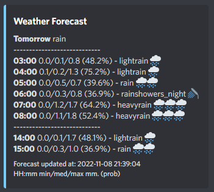

# weather-bot

Discord bot that keeps you updated when it is going to rain 🌧



Weather forecasts are fetched from the [YR API](https://developer.yr.no/). 

Features:
- Get notified about the weather forecast for today or tomorrow at a custom time every day
- Ask for the current weather

## Setup

Create environment 
```
conda create --name weather_bot --file requirements.txt 
conda activate weather_bot
``` 

Set up environment config
- Insert Discord bot token and a default lat/lon into `example.env` (see [Using a database](using-a-database-not-implemented) for using a database to store a default coordinate for each guild)
- Rename the file to `.env`  
    - Or a use a custom name (e.g. `dev.env` or `prod.env`). For a custom named .env file, the path should be given as argument when running the bot using the `-e` option. 

Run
```
python main.py
```
Run with a custom named environment file called `dev.env` 
```
python main.py -e dev.env
```

### Using a database (NOT IMPLEMENTED)
Instead of using static coordinates, it is possible to store a default location for each guild in a database. Add the database credentials in the `.env` file and remember to set `DB_ENABLED=TRUE`. 


## Remarks
- All requests to the YR API are cached with respect to the individual `Expire` response header to comply with their TOS. As such, muliple forecast requests for the same coordinate will only result in a single http request until the response expires (typically 0.5 hour it seems). 


