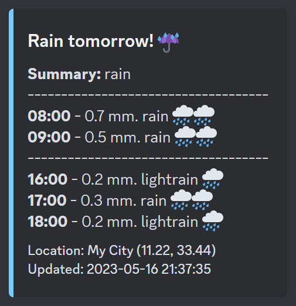

# weather-bot

[](https://github.com/holstt/weather-bot/actions/workflows/build.yaml)

Discord bot alerting you if it's going to rain tomorrow 🌧



## Features

-   Daily notification if (and only if) it's going to rain tomorrow including period and precipitation amount (best estimate). Be prepared for your daily commute and when to plan for outdoor activities! 🏃🚴🤸
-   Customize the notification to your needs:
    -   Set preferred time of day for the daily alert
    -   Specify the exact location for which to retrieve weather data, using latitude and longitude.
-   Weather data from any location provided by the [YR API](https://developer.yr.no/)

#### Todo:

-   [ ] Command: Show rainy hours for a given period
-   [ ] Set up weather alerts: Get notified if a weather metric gets above/below a certain threshold within a rolling time window
    -   Example: Get notified if the temperature drops below 0°C within the next 24 hours
    -   Example: Get notified about the 3-hour window having the lowest wind speeds within the next 24 hours to help plan the ideal time to go for a bike ride
-   [ ] Charts: Show detailed weather forecast for a given period as a chart
-   [ ] Weekly weather forecast: Get a weekly weather forecast with custom highlights to plan for the week ahead
-   [ ] Customize rainy hour alert
    -   [ ] Require minimum precipitation amount
    -   [ ] Require minimum precipitation probability
    -   [ ] Choose which precipitation metrics to include in the alert: best estimate, min, max, probability

## Requirements

-   [Discord bot token](https://discord.com/developers/docs/intro)
-   [YR API key](https://developer.yr.no/)
-   If running locally: The Poetry package manager, see [installation instructions](https://python-poetry.org/docs/#installation)
-   If running with Docker: [Docker](https://docs.docker.com/get-docker/) and [Docker Compose](https://docs.docker.com/compose/install/)

## Getting Started

**1. Clone the repository**:

```
git clone https://github.com/holstt/weather-bot.git
cd weather-bot
```

**2. Set up configuration**

The bot is configured using environment variables, which can be specified in a `.env` file or set directly in the environment.

`./example.env` provides an example of the required variables. Rename the file to `.env` and edit the values as needed:

| Environment Variable | Type    | Description                                                                                                                          |
| -------------------- | ------- | ------------------------------------------------------------------------------------------------------------------------------------ |
| `BOT_TOKEN`          | String  | Discord API token                                                                                                                    |
| `DEV_CHANNEL_ID`     | Integer | Channel to get notified when the bot is online                                                                                       |
| `TARGET_CHANNEL_ID`  | Integer | Channel to get notified about weather forecasts. Can be the same as `DEV_CHANNEL_ID`                                                 |
| `LAT`                | Float   | Default latitude                                                                                                                     |
| `LON`                | Float   | Default longitude                                                                                                                    |
| `TIME_ZONE`          | String  | IANA time zone of guild. See [this list](https://en.wikipedia.org/wiki/List_of_tz_database_time_zones) for all available time zones. |

## Running Locally 💻

**3. Install the dependencies and create a virtual environment**

```
poetry install
```

**4. Activate the virtual environment**

```
poetry shell
```

**5. Run the bot**

```
python main.py
```

If you use a `.env` file to configure the environment, the program assumes it is named `.env` and located in the root of the project folder. Alternatively, you can provide a custom name/path for the environment file (e.g. if you create both a `dev.env` and `prod.env` file). Use `-e` to pass the path as an argument when running the bot:

```
python main.py -e path/to/my.env
```

## Running with Docker Compose 🐳

Using docker-compose is the easiest way to run the bot.

**3. From project root, navigate to the `./docker` folder**

```
cd docker
```

**4. Configure and run the Docker project**

`docker-compose.yml` expects the environment variables to be defined in a file named `.env` located in root of the project folder. Set the `ENV_PATH` environment variable if you use a different name or location for the environment file. Then run:

```
docker-compose up -d
```

## Additional Information

#### Cache

All requests to the YR API are cached with respect to their individual `Expire` response header to comply with the YR TOS. As such, muliple forecast requests for the same coordinate will only result in a single http request until the response expires (typically 0.5 hour it seems). The cache will be stored as a sqlite db at `./data/http_cache.sqlite`.

#### Git hooks

This project uses [pre-commit](https://pre-commit.com/) to run git hooks. The hooks are defined in `.pre-commit-config.yaml` and can be installed by running:

```
pre-commit install
```
